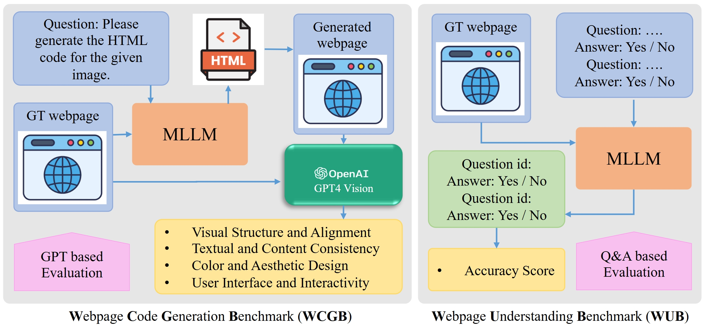

# Overview

<p>
    Our Web2Code instruction tuning dataset construction and instruction generation process involves four key components: (1) Creation of new webpage image-code pair data (DWCG). (2) Refinement of existing webpage code generation data (DWCG<sub>R</sub>). (3) Creation of a new text question-answer pair data (DWU). (4) Refinement of existing webpage understanding data (DWU<sub>R</sub>).
</p>


# Statistics and Distribution

<style>
    table {
        font-family:Arial, sans-serif;
        font-size:14px;
    }
</style>

<p>
    Comparison of dataset statistics among webpage code generation datasets; WebSight, Design2Code, Pix2Code, our DWCG, and our DWCGR.
</p>
<table>
    <tr>
        <th>Dataset</th> <th>WebSight</th> <th>Design2Code</th> <th>Pix2Code</th> <th>DWCG</th> <th>DWCG<sub>R</sub></th>
    </tr>
    <tr>
        <th>Instruction</th> <th>-</th> <th>-</th> <th>-</th> <th>✓</th> <th>✓</th>
    </tr>
    <tr>
        <th>Source</th> <th>Synthetic</th> <th>Real-World</th> <th>Synthetic</th> <th>Synthetic</th> <th>Synthetic</th>
    </tr>
    <tr>
        <th>Size</th> <th>823K</th> <th>484</th> <th>1.7K</th> <th>60K</th> <th>824.7K</th>
    </tr>
    <tr>
        <th>Avg Length (tokens)</th> <th>647±216</th> <th>31216±23902</th> <th>658.7±98.0</th> <th>471.8±162.3</th> <th>652.85±157.0</th>
    </tr>
    <tr>
        <th>Avg Tag Count</th> <th>19±8</th> <th>158±100</th> <th>51.6±8.0</th> <th>28.1±10.6</th> <th>35.3±9.0</th>
    </tr>
    <tr>
        <th>Avg DOM Depth</th> <th>5±1</th> <th>13±5</th> <th>8.0±0.0</th> <th>5.3±1.0</th> <th>6.5±1.0</th>
    </tr>  
    <tr>
        <th>Avg Unique Tags</th> <th>10±3</th> <th>22±6</th> <th>17.0±0.0</th> <th>13.6±2.7</th> <th>13.5±2.5</th>
    </tr>
</table>
<p>
    Distribution of DWU and DWUR datasets. Both datasets include high-quality question-answer pairs for webpage understanding.
</p>
<table>
    <tr>
        <th>Dataset</th> <th>DWU</th> <th>DWU<sub>R</sub></th>
    </tr>
    <tr>
        <th>Instruction</th> <th>✓</th> <th>✓</th>
    </tr>
    <tr>
        <th>Size</th> <th>243.5K</th> <th>51.5K</th>
    </tr>
</table>
<p>
    The distribution the most common HTML tags in our GPT-3.5 generated HTML data.
</p>


# Evaluation Frameworkc

## Evaluation Metric for HTML Code Generation
<p>
    Our proposed evaluation framework includes two schemes: (1) Webpage Understanding Benchmark (WUB): An offline evaluation using ‘yes’/‘no’ questions. (2) Webpage Code Generation Benchmark (WCGB): An online evaluation (using GPT-4 Vision) based on image similarity.
</p>


## Quantitative Evaluation for HTML Code Generation of MLLMs

<p>
    The accuracy of webpage understanding under various data configurations and LLM backbones. All models are instruction-tuned and evaluated on our WUB benchmark. We note that the general domain data (i.e., LLaVA) is included in all data configuration as default.
</p>
<table>
    <tr>
        <th>LLM Backbone</th> <th>DWCG</th> <th>DWU</th> <th>DWCGR</th> <th>DWUR</th> <th>Accuracy (%)</th>
    </tr>
    <tr>
        <th rowspan="2">CrystalCoder-7B</th> <th>✓</th> <th>-</th> <th>-</th> <th>-</th> <th>71.81</th>
    </tr>
    <tr>
        <th>✓</th> <th>✓</th> <th>-</th> <th>-</th> <th>73.74</th>
    </tr>
    <tr>
        <th rowspan="3">CrystalChat-7B</th> <th>-</th> <th>-</th> <th>-</th> <th>-</th> <th>73.94</th>
    </tr>
    <tr>
        <th>✓</th> <th>✓</th> <th>-</th> <th>-</th> <th>73.48</th>
    </tr>
    <tr>
        <th>✓</th> <th>✓</th> <th>✓</th> <th>✓</th> <th>74.14</th>
    </tr>
    <tr>
        <th>LLaMA3-8B</th> <th>✓</th> <th>✓</th> <th>✓</th> <th>✓</th> <th>74.84</th>
    </tr>
</table>
<p>
    The performance of different LLM backbones under various data configurations on our Webpage Code Generation Benchmark (WCGB). "VSA" denotes Visual Structure and Alignment, "CAD" represents Color and Aesthetic Design, "TCC" represents Textual and Content Consistency, and "UII" denotes User Interface and Interactivity
</p>
<table>
    <tr>
        <th>LLM Backbone</th> <th>DWCG</th> <th>DWU</th> <th>DWCGR</th> <th>DWUR</th> <th>VSA ↑</th> <th>CAD ↑</th> <th>TCC ↑</th> <th>UII ↑</th> <th>Overall ↑</th>
    </tr>
    <tr>
        <th rowspan="2">CystalCoder-7B</th> <th>✓</th> <th>-</th> <th>-</th> <th>-</th> <th>7.812</th> <th>7.899</th> <th>8.138</th> <th>8.112</th> <th>7.990</th>
    </tr>
    <tr>
        <th>✓</th> <th>✓</th> <th>-</th> <th>-</th> <th>8.010</th> <th>8.102</th> <th>8.266</th> <th>8.124</th> <th>8.126</th>
    </tr>
    <tr>
        <th rowspan="3">CrystalChat-7B</th> <th>-</th> <th>-</th> <th>-</th> <th>-</th> <th>4.714</th> <th>4.572</th> <th>4.865</th> <th>5.147</th> <th>4.825</th>
    </tr>
    <tr>
        <th>✓</th> <th>✓</th> <th>-</th> <th>-</th> <th>7.900</th> <th>8.001</th> <th>8.204</th> <th>8.215</th> <th>8.080</th>
    </tr>
    <tr>
        <th>✓</th> <th>✓</th> <th>✓</th> <th>✓</th> <th>8.384</th> <th>8.287</th> <th>8.417</th> <th>8.488</th> <th>8.394</th>
    </tr>
    <tr>
        <th>LLaMA3-8B</th> <th>✓</th> <th>✓</th> <th>✓</th> <th>✓</th> <th>8.522</th> <th>8.564</th> <th>8.421</th> <th>8.611</th> <th>8.530</th>
    </tr>
</table>

# Examples
<p>
    Some examples of our dataset.
</p>
<table>
    <tr>
        <td></td>
    </tr>
    <tr>
        <td></td>
    </tr>
    <tr>
        <td></td>
    </tr>
</table>

# Bibtext

```bib
TODO
```

# Acknowledgement

TODO

## Header 2

> This is a blockquote following a header.
>
> When something is important enough, you do it even if the odds are not in your favor.

### Header 3

```js
// Javascript code with syntax highlighting.
var fun = function lang(l) {
  dateformat.i18n = require('./lang/' + l)
  return true;
}
```

```ruby
# Ruby code with syntax highlighting
GitHubPages::Dependencies.gems.each do |gem, version|
  s.add_dependency(gem, "= #{version}")
end
```

#### Header 4

*   This is an unordered list following a header.
*   This is an unordered list following a header.
*   This is an unordered list following a header.

##### Header 5

1.  This is an ordered list following a header.
2.  This is an ordered list following a header.
3.  This is an ordered list following a header.

###### Header 6

| head1        | head two          | three |
|:-------------|:------------------|:------|
| ok           | good swedish fish | nice  |
| out of stock | good and plenty   | nice  |
| ok           | good `oreos`      | hmm   |
| ok           | good `zoute` drop | yumm  |

### There's a horizontal rule below this.

* * *

### Here is an unordered list:

*   Item foo
*   Item bar
*   Item baz
*   Item zip

### And an ordered list:

1.  Item one
1.  Item two
1.  Item three
1.  Item four

### And a nested list:

- level 1 item
  - level 2 item
  - level 2 item
    - level 3 item
    - level 3 item
- level 1 item
  - level 2 item
  - level 2 item
  - level 2 item
- level 1 item
  - level 2 item
  - level 2 item
- level 1 item

### Small image


### Large image


### Definition lists can be used with HTML syntax.

<dl>
<dt>Name</dt>
<dd>Godzilla</dd>
<dt>Born</dt>
<dd>1952</dd>
<dt>Birthplace</dt>
<dd>Japan</dd>
<dt>Color</dt>
<dd>Green</dd>
</dl>

```
Long, single-line code blocks should not wrap. They should horizontally scroll if they are too long. This line should be long enough to demonstrate this.
```

```
The final element.
```

