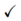
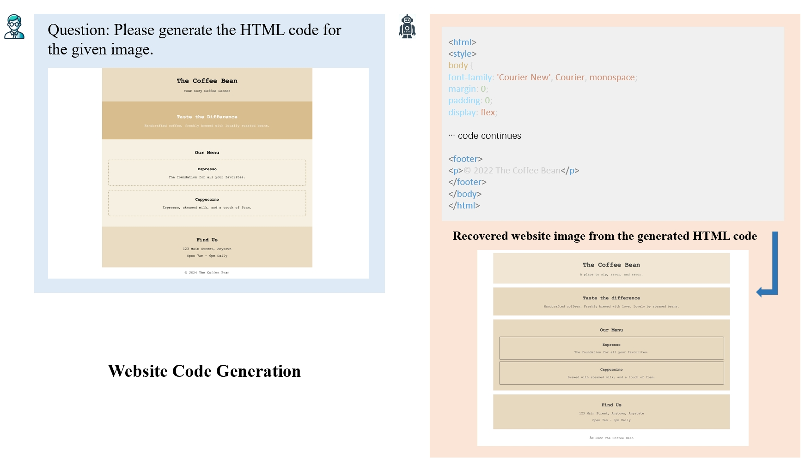
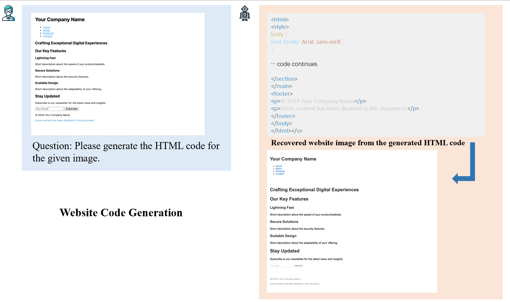
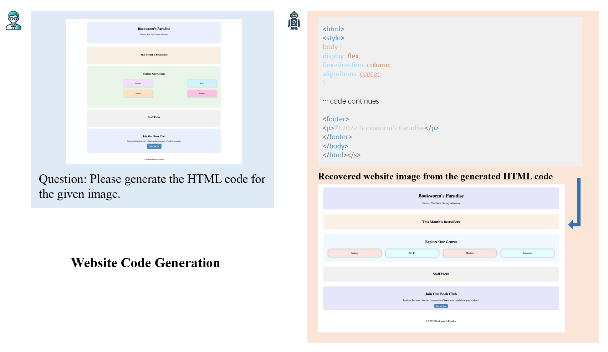

Text can be **bold**, _italic_, or ~~strikethrough~~.

[Link to another page](./another-page.html).

There should be whitespace between paragraphs.

There should be whitespace between paragraphs. We recommend including a README, or a file with information about your project.

# Overview

<p>
    Our Web2Code instruction tuning dataset construction and instruction generation process involves four key components: (1) Creation of new webpage image-code pair data (DWCG). (2) Refinement of existing webpage code generation data (DWCG<sub>R</sub>). (3) Creation of a new text question-answer pair data (DWU). (4) Refinement of existing webpage understanding data (DWU<sub>R</sub>).
</p>


# Statistics and Distribution

<table>
    <tr>
        <th>Dataset</th> <th>WebSight</th> <th>Design2Code</th> <th>Pix2Code</th> <th>DWCG</th> <th>DWCG<sub>R</sub></th>
    </tr>
    <tr>
        <th>Instruction</th> <th>-</th> <th>-</th> <th>-</th> <th></th> <th></th>
    </tr>
    <tr>
        <th>Source</th> <th>Synthetic</th> <th>Real-World</th> <th>Synthetic</th> <th>Synthetic</th> <th>Synthetic</th>
    </tr>
    <tr>
        <th>Size</th> <th>823K</th> <th>484</th> <th>1.7K</th> <th>60K</th> <th>824.7K</th>
    </tr>
    <tr>
        <th>Avg Length (tokens)</th> <th>647±216</th> <th>31216±23902</th> <th>658.7±98.0</th> <th>471.8±162.3</th> <th>652.85±157.0</th>
    </tr>
    <tr>
        <th>Avg Tag Count</th> <th>19±8</th> <th>158±100</th> <th>51.6±8.0</th> <th>28.1±10.6</th> <th>35.3±9.0</th>
    </tr>
    <tr>
        <th>Avg DOM Depth</th> <th>5±1</th> <th>13±5</th> <th>8.0±0.0</th> <th>5.3±1.0</th> <th>6.5±1.0</th>
    </tr>  
    <tr>
        <th>Avg Unique Tags</th> <th>10±3</th> <th>22±6</th> <th>17.0±0.0</th> <th>13.6±2.7</th> <th>13.5±2.5</th>
    </tr>
</table>

# Performance

# Examples
<table>
    <tr>
        <td></td>
    </tr>
    <tr>
        <td></td>
    </tr>
    <tr>
        <td></td>
    </tr>
</table>

# Bibtext

# Acknowledgement


## Header 2

> This is a blockquote following a header.
>
> When something is important enough, you do it even if the odds are not in your favor.

### Header 3

```js
// Javascript code with syntax highlighting.
var fun = function lang(l) {
  dateformat.i18n = require('./lang/' + l)
  return true;
}
```

```ruby
# Ruby code with syntax highlighting
GitHubPages::Dependencies.gems.each do |gem, version|
  s.add_dependency(gem, "= #{version}")
end
```

#### Header 4

*   This is an unordered list following a header.
*   This is an unordered list following a header.
*   This is an unordered list following a header.

##### Header 5

1.  This is an ordered list following a header.
2.  This is an ordered list following a header.
3.  This is an ordered list following a header.

###### Header 6

| head1        | head two          | three |
|:-------------|:------------------|:------|
| ok           | good swedish fish | nice  |
| out of stock | good and plenty   | nice  |
| ok           | good `oreos`      | hmm   |
| ok           | good `zoute` drop | yumm  |

### There's a horizontal rule below this.

* * *

### Here is an unordered list:

*   Item foo
*   Item bar
*   Item baz
*   Item zip

### And an ordered list:

1.  Item one
1.  Item two
1.  Item three
1.  Item four

### And a nested list:

- level 1 item
  - level 2 item
  - level 2 item
    - level 3 item
    - level 3 item
- level 1 item
  - level 2 item
  - level 2 item
  - level 2 item
- level 1 item
  - level 2 item
  - level 2 item
- level 1 item

### Small image


### Large image


### Definition lists can be used with HTML syntax.

<dl>
<dt>Name</dt>
<dd>Godzilla</dd>
<dt>Born</dt>
<dd>1952</dd>
<dt>Birthplace</dt>
<dd>Japan</dd>
<dt>Color</dt>
<dd>Green</dd>
</dl>

```
Long, single-line code blocks should not wrap. They should horizontally scroll if they are too long. This line should be long enough to demonstrate this.
```

```
The final element.
```

